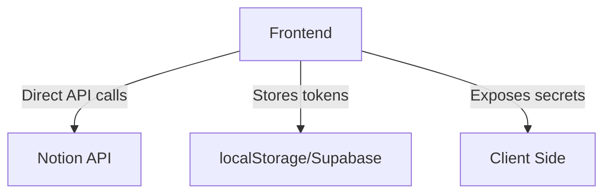
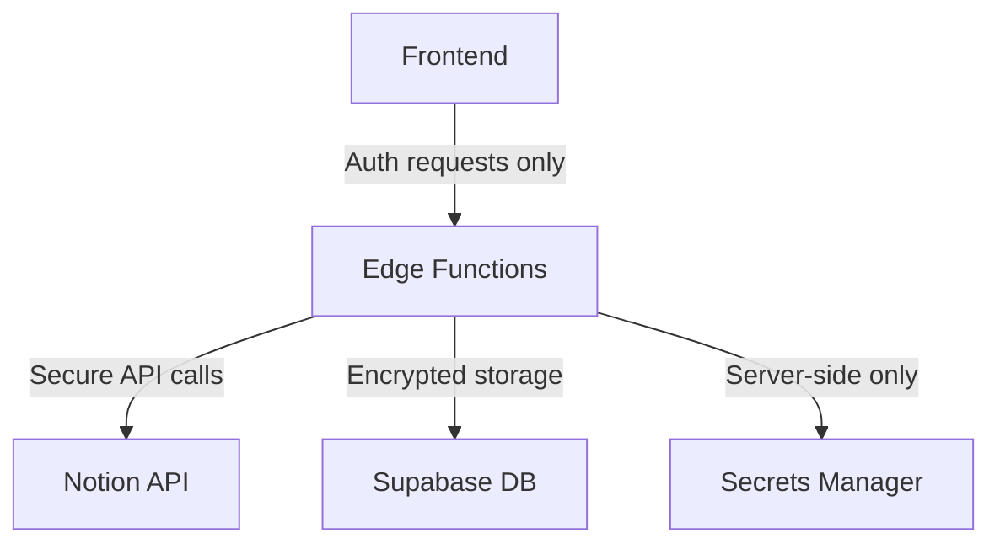

# Guide de Migration Sécurisée - Notion Backend

## 🔒 Vue d'ensemble

Cette migration déplace toute la logique Notion vers un backend sécurisé, éliminant l'exposition des tokens côté client et renforçant la sécurité globale.

## 📋 Étapes de Migration

### 1. Déploiement Backend

#### A. Fonctions Edge Supabase

```bash
# Déployer la nouvelle fonction Edge
supabase functions deploy notion-api

# Vérifier le déploiement
curl https://your-project.supabase.co/functions/v1/notion-api/test
```

#### B. Variables d'environnement

Ajouter dans Supabase Dashboard > Settings > Edge Functions :

```env
NOTION_CLIENT_ID=your_notion_client_id
NOTION_CLIENT_SECRET=your_notion_client_secret
SITE_URL=https://your-domain.com
```

#### C. Migrations de base de données

```bash
# Appliquer les migrations de sécurité
supabase db push

# Ou manuellement
psql -h your-db-host -U postgres -d your-db -f supabase/migrations/20240910_notion_security.sql
```

### 2. Migration Frontend

#### A. Remplacement des services

```typescript
// Ancien (non sécurisé)
import { notionService } from '../services/notionService';

// Nouveau (sécurisé)
import { secureNotionService } from '../services/secureNotionService';
```

#### B. Mise à jour des composants

```typescript
// Remplacer NotionBlock.tsx
import { secureNotionService } from '../services/secureNotionService';

// Remplacer NotionConnectButton.tsx par SecureNotionConnectButton.tsx
import SecureNotionConnectButton from './SecureNotionConnectButton';
```

#### C. Mise à jour des connecteurs

```typescript
// Remplacer NotionConnector.ts
import { SecureNotionConnector } from '../connectors/SecureNotionConnector';

// Dans useWorkflowEngine.ts
const notionConnector = new SecureNotionConnector();
```

### 3. Configuration Sécurisée

#### A. Variables d'environnement frontend

```env
# .env.local
NEXT_PUBLIC_SUPABASE_URL=https://your-project.supabase.co
NEXT_PUBLIC_SUPABASE_ANON_KEY=your_anon_key

# ❌ SUPPRIMER ces variables (maintenant backend only)
# NEXT_PUBLIC_NOTION_CLIENT_ID=...
# NOTION_CLIENT_SECRET=...
```

#### B. URLs de callback

Mettre à jour dans Notion OAuth settings :
```
https://your-domain.com/auth/callback/notion
```

## 🔧 Changements Techniques

### Avant (Non sécurisé)


### Après (Sécurisé)


### Avantages de Sécurité

1. **🔐 Tokens chiffrés** : Stockage sécurisé côté serveur
2. **🛡️ Pas d'exposition client** : Secrets jamais envoyés au frontend
3. **🔍 Audit logs** : Traçabilité complète des appels API
4. **⚡ Performance** : Mise en cache côté serveur
5. **🚫 CSRF protection** : States OAuth sécurisés

## 📝 Plan de Déploiement

### Phase 1 : Préparation (30 min)
- [ ] Déployer les fonctions Edge
- [ ] Appliquer les migrations DB
- [ ] Configurer les variables d'environnement
- [ ] Tester l'API backend

### Phase 2 : Migration Code (45 min)
- [ ] Remplacer `notionService` par `secureNotionService`
- [ ] Mettre à jour tous les composants Notion
- [ ] Remplacer les connecteurs
- [ ] Tester l'intégration

### Phase 3 : Nettoyage (15 min)
- [ ] Supprimer `src/services/notionService.ts`
- [ ] Supprimer `src/connectors/NotionConnector.ts`
- [ ] Nettoyer les variables d'environnement frontend
- [ ] Supprimer les anciens composants

### Phase 4 : Tests (30 min)
- [ ] Test OAuth complet
- [ ] Test récupération pages/databases
- [ ] Test création/modification contenu
- [ ] Test déconnexion
- [ ] Vérification logs d'audit

## 🧪 Tests de Validation

### Test 1 : Authentification
```bash
curl -X POST https://your-project.supabase.co/functions/v1/notion-api/auth/initiate \
  -H "Authorization: Bearer $USER_TOKEN" \
  -H "Content-Type: application/json"
```

### Test 2 : Récupération pages
```bash
curl https://your-project.supabase.co/functions/v1/notion-api/pages \
  -H "Authorization: Bearer $USER_TOKEN"
```

### Test 3 : Statut connexion
```bash
curl https://your-project.supabase.co/functions/v1/notion-api/auth/status \
  -H "Authorization: Bearer $USER_TOKEN"
```

## 🚨 Points d'Attention

### Sécurité
1. **Jamais** exposer `NOTION_CLIENT_SECRET` côté client
2. Utiliser HTTPS uniquement pour les callbacks OAuth
3. Vérifier les politiques RLS Supabase
4. Monitorer les logs d'audit

### Performance
1. Implementer la mise en cache pour les appels fréquents
2. Utiliser la pagination pour les listes importantes
3. Optimiser les requêtes Supabase

### Monitoring
1. Surveiller les Edge Functions logs
2. Alertes sur les erreurs d'authentification
3. Métriques d'utilisation API Notion

## 📞 Support

En cas de problème :

1. **Vérifier les logs Edge Functions** dans Supabase Dashboard
2. **Tester l'API backend** avec curl/Postman
3. **Vérifier les politiques RLS** pour les nouvelles tables
4. **Consulter les logs d'audit** pour tracer les erreurs

## 🎯 Rollback Plan

Si problème critique :

1. **Restaurer l'ancien service** :
   ```typescript
   // Temporairement remettre notionService
   import { notionService } from '../services/notionService';
   ```

2. **Désactiver les nouvelles fonctions** Edge Functions

3. **Revenir aux variables d'environnement** frontend

4. **Investiguer et corriger** avant nouvelle tentative

---

✅ **Migration complète** = Backend 100% sécurisé + Frontend minimal + Audit complet