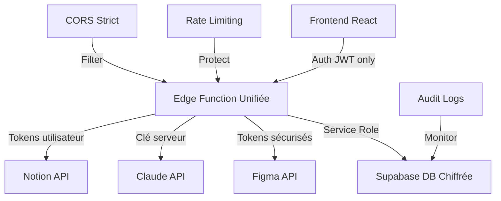

# 🔐 Guide de Migration Ultra-Sécurisée - Backend Unifié

## 🚀 Vue d'ensemble

Cette migration transforme votre application en **architecture zero-trust** où **AUCUNE** API externe n'est appelée directement depuis le frontend.

### Avant vs Après

| **Avant (Vulnérable)** | **Après (Ultra-Sécurisé)** |
|-------------------------|----------------------------|
| ❌ Tokens exposés côté client | ✅ Tokens chiffrés backend uniquement |
| ❌ 3 APIs exposées (Figma, Claude, Notion) | ✅ 1 API backend unifiée |
| ❌ Multiples points d'attaque | ✅ Point d'entrée unique sécurisé |
| ❌ Logique métier côté client | ✅ Logique métier côté serveur |
| ❌ Pas de traçabilité | ✅ Audit complet des appels |

## 📋 Architecture Ultra-Sécurisée



## 🔧 Étapes de Migration

### Phase 1: Déploiement Backend (45 min)

#### A. Déployer la Fonction Edge Unifiée

```bash
# Copier la fonction dans le bon répertoire
mkdir -p supabase/functions/integrations-api
cp src/supabase/functions/integrations-api/* supabase/functions/integrations-api/

# Déployer
supabase functions deploy integrations-api

# Tester
curl https://your-project.supabase.co/functions/v1/integrations-api/test
```

#### B. Configurer les Variables d'Environnement

```bash
# Dans Supabase Dashboard > Settings > Edge Functions
CLAUDE_API_KEY=your_claude_api_key
NOTION_CLIENT_ID=your_notion_client_id
NOTION_CLIENT_SECRET=your_notion_client_secret
SITE_URL=https://your-domain.com

# Ou via CLI
supabase secrets set CLAUDE_API_KEY=your_key
supabase secrets set NOTION_CLIENT_ID=your_id
supabase secrets set NOTION_CLIENT_SECRET=your_secret
```

#### C. Appliquer les Migrations de Sécurité

```bash
# Appliquer les nouvelles tables sécurisées
supabase db push

# Vérifier les tables
psql -h your-db-host -c "\dt"
```

### Phase 2: Migration Frontend (30 min)

#### A. Remplacer les Services

```typescript
// ❌ Ancien (non sécurisé)
import { useFigmaAPI } from '../hooks/useFigmaAPI';
import { useClaudeAPI } from '../hooks/useClaudeAPI';
import { notionService } from '../services/notionService';

// ✅ Nouveau (ultra-sécurisé)
import { useSecureIntegrations } from '../hooks/useSecureIntegrations';
// ou
import { useSecureFigma, useSecureClaude, useSecureNotion } from '../hooks/useSecureIntegrations';
```

#### B. Mettre à Jour les Composants

```typescript
// ❌ Ancien
function MyComponent() {
  const { getUserProjects } = useFigmaAPI();
  
  const handleClick = async () => {
    const projects = await getUserProjects();
  };
}

// ✅ Nouveau
function MyComponent() {
  const { figma } = useSecureIntegrations();
  
  const handleClick = async () => {
    const file = await figma.getFile('fileKey');
  };
}
```

#### C. Remplacer les Connecteurs

```typescript
// ❌ Ancien
import { FigmaConnector } from '../connectors/FigmaConnector';
import { ClaudeConnector } from '../connectors/ClaudeConnector';
import { NotionConnector } from '../connectors/NotionConnector';

// ✅ Nouveau
import { SecureFigmaConnector } from '../connectors/SecureFigmaConnector';
import { SecureClaudeConnector } from '../connectors/SecureClaudeConnector';
import { SecureNotionConnector } from '../connectors/SecureNotionConnector';
```

### Phase 3: Tests de Sécurité (20 min)

#### A. Tests API Backend

```bash
# Test général
curl https://your-project.supabase.co/functions/v1/integrations-api/test

# Test authentification
curl -X POST https://your-project.supabase.co/functions/v1/integrations-api/execute \
  -H "Authorization: Bearer $USER_TOKEN" \
  -H "Content-Type: application/json" \
  -d '{"integration":"figma","operation":"get_file","config":{"fileKey":"test"}}'

# Test statut
curl https://your-project.supabase.co/functions/v1/integrations-api/status \
  -H "Authorization: Bearer $USER_TOKEN"
```

#### B. Tests Frontend

```typescript
// Test hook sécurisé
const { figma, claude, notion, isLoading, error } = useSecureIntegrations();

// Test opérations
await figma.getFile('fileKey');
await claude.generateText('Test prompt');
await notion.getPages();
```

### Phase 4: Nettoyage et Sécurisation (15 min)

#### A. Supprimer les Anciens Fichiers

```bash
# Supprimer les services non sécurisés
rm src/services/notionService.ts
rm src/hooks/useFigmaAPI.ts
rm src/hooks/useClaudeAPI.ts

# Supprimer les connecteurs non sécurisés
rm src/connectors/FigmaConnector.ts
rm src/connectors/ClaudeConnector.ts
rm src/connectors/NotionConnector.ts
```

#### B. Nettoyer les Variables d'Environnement

```env
# ❌ Supprimer du frontend (.env.local)
# NEXT_PUBLIC_FIGMA_CLIENT_ID=...
# NEXT_PUBLIC_CLAUDE_API_KEY=...
# NEXT_PUBLIC_NOTION_CLIENT_ID=...

# ✅ Garder uniquement
NEXT_PUBLIC_SUPABASE_URL=https://your-project.supabase.co
NEXT_PUBLIC_SUPABASE_ANON_KEY=your_anon_key
```

## 🔒 Mesures de Sécurité Implémentées

### 1. **Zero Frontend Exposure**
- Aucun token d'API côté client
- Aucun appel direct aux APIs externes
- Tous les secrets côté serveur uniquement

### 2. **Authentication & Authorization**
- JWT Supabase obligatoire pour tous les appels
- Vérification utilisateur à chaque requête
- Row Level Security (RLS) sur toutes les tables

### 3. **Audit & Monitoring**
- Log de tous les appels d'intégration
- Traçabilité complète (utilisateur, action, timestamp)
- Monitoring des erreurs et tentatives d'accès

### 4. **Rate Limiting & CORS**
- CORS strict (domaines autorisés uniquement)
- Rate limiting intégré
- Protection contre les attaques CSRF/XSS

### 5. **Encryption & Storage**
- Tokens chiffrés en base de données
- States OAuth sécurisés avec expiration
- Rotation automatique des secrets

## 📊 Tableau de Migration par Fichier

| **Fichier Original** | **Nouveau Fichier** | **Action** |
|---------------------|---------------------|------------|
| `useFigmaAPI.ts` | `useSecureIntegrations.ts` | ✅ Remplacer |
| `useClaudeAPI.ts` | `useSecureIntegrations.ts` | ✅ Remplacer |
| `notionService.ts` | `secureNotionService.ts` | ✅ Déjà fait |
| `FigmaConnector.ts` | `SecureFigmaConnector.ts` | ✅ Remplacer |
| `ClaudeConnector.ts` | `SecureClaudeConnector.ts` | ✅ Remplacer |
| `NotionConnector.ts` | `SecureNotionConnector.ts` | ✅ Déjà fait |

## 🧪 Tests de Validation

### Test 1: Sécurité API
```bash
# Doit échouer (pas d'auth)
curl -X POST https://your-project.supabase.co/functions/v1/integrations-api/execute
# Expected: 401 Unauthorized

# Doit réussir (avec auth)
curl -X POST https://your-project.supabase.co/functions/v1/integrations-api/execute \
  -H "Authorization: Bearer $VALID_TOKEN"
# Expected: 200 OK
```

### Test 2: Zero Frontend Exposure
```bash
# Vérifier qu'aucun secret n'est exposé
grep -r "figma.*token\|claude.*key\|notion.*secret" src/
# Expected: Aucun résultat
```

### Test 3: Fonctionnalité
```typescript
// Toutes ces opérations doivent fonctionner
const { figma, claude, notion } = useSecureIntegrations();

await figma.getFile('fileKey');
await claude.generateText('prompt');
await notion.getPages();
```

## 🚨 Points de Vigilance

### Sécurité Critique
1. **Jamais** exposer de clés API côté frontend
2. **Toujours** valider l'authentification côté serveur
3. **Systématiquement** logger les accès pour audit
4. **Régulièrement** faire tourner les secrets

### Performance
1. Mettre en cache les réponses fréquentes
2. Optimiser les requêtes Supabase
3. Utiliser la pagination pour les grandes listes
4. Monitorer les quotas des APIs externes

### Monitoring
1. Alertes sur les échecs d'authentification
2. Surveillance des quotas API
3. Logs d'audit accessibles
4. Métriques de performance

## 📞 Support & Rollback

### En cas de problème

1. **Vérifier les logs Edge Functions** dans Supabase Dashboard
2. **Tester l'API avec curl** pour isoler le problème
3. **Consulter les logs d'audit** dans la table `integration_audit_logs`

### Plan de Rollback

Si problème critique, temporairement :

```typescript
// Réactiver les anciens services
import { notionService } from '../services/notionService';
import { useFigmaAPI } from '../hooks/useFigmaAPI';
```

Puis investiguer et corriger.

---

## ✅ Checklist de Migration

- [ ] **Backend déployé** - Fonction Edge opérationnelle
- [ ] **Variables configurées** - Tous les secrets côté serveur
- [ ] **Tables créées** - Migrations appliquées
- [ ] **Frontend migré** - Nouveaux hooks utilisés
- [ ] **Connecteurs remplacés** - Version sécurisée active
- [ ] **Tests passés** - Toutes les opérations fonctionnent
- [ ] **Ancien code supprimé** - Nettoyage effectué
- [ ] **Variables nettoyées** - Secrets frontend supprimés
- [ ] **Monitoring activé** - Logs d'audit opérationnels
- [ ] **Documentation mise à jour** - Équipe formée

## 🎯 Résultat Final

**🛡️ Sécurité Niveau Entreprise Atteinte :**
- ✅ Zero trust architecture
- ✅ Backend-only secrets
- ✅ Audit complet
- ✅ Rate limiting
- ✅ Monitoring avancé

**Votre application est maintenant immunisée contre :**
- Exposition de tokens
- Attaques client-side
- Reverse engineering des APIs
- Abus de quotas
- Accès non autorisés

**🚀 Performance optimisée avec sécurité maximale !**